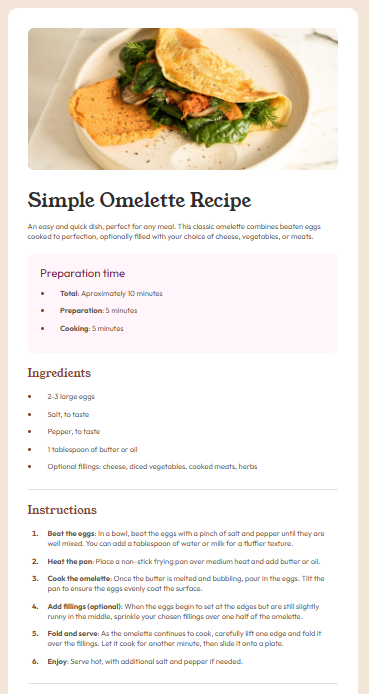

<p align="center">
  <h1 align="center">Recipe Page – HTML & CSS Practice</h1>
  <p align="center">
    A simple recipe page built to practice semantic HTML and CSS layout.
  </p>
</p>

A simple recipe page built as part of a frontend development course.
The goal of this project was to practice semantic HTML, typography, and CSS layout by recreating a recipe page design.

## 📸 Preview



## 🚀 Technologies Used

* HTML5
* CSS3
* Google Fonts

## 🎯 What I Practiced

* Semantic HTML structure (`article`, `section`, `ul`, `ol`)
* Typography and spacing
* Styling lists and markers with CSS
* Understanding the CSS box model
* Layout spacing using margin and padding

## 📂 Project Structure

```
recipe-page/
│
├── index.html
├── style.css
└── images/
```

## 💡 What I Learned

While building this project I improved my understanding of:

* Structuring HTML documents correctly
* Managing spacing using margin and padding
* Styling lists and pseudo-elements like `::marker`
* Organizing CSS for readability

## 📌 Future Improvements

* Improve responsive design
* Refactor layout using Flexbox
* Add accessibility improvements

---
<p align="center">
  <h1 align="center">Página de Receta – Práctica de HTML y CSS</h1>
</p>

Esta es una página de receta creada como parte de una práctica de desarrollo frontend.
El objetivo de este proyecto fue practicar el uso de HTML semántico, tipografía y maquetación con CSS recreando un diseño de una página de receta.

## 🚀 Tecnologías utilizadas

* HTML5
* CSS3
* Google Fonts

## 🎯 Qué practiqué

* Estructura semántica en HTML (`article`, `section`, `ul`, `ol`)
* Tipografía y espaciado
* Estilización de listas y marcadores con CSS
* Comprensión del modelo de caja en CSS
* Manejo de espacios utilizando `margin` y `padding`

## 💡 Qué aprendí

Durante este proyecto mejoré mi comprensión sobre:

* Cómo estructurar correctamente un documento HTML
* Cómo manejar los espacios usando `margin` y `padding`
* Cómo estilizar listas y pseudo-elementos como `::marker`
* Cómo organizar el CSS para que sea más legible

## 👨‍💻 Autor

Harol Contreras
Estudiante de desarrollo web y tecnologías relacionadas al desarrollo de software.
